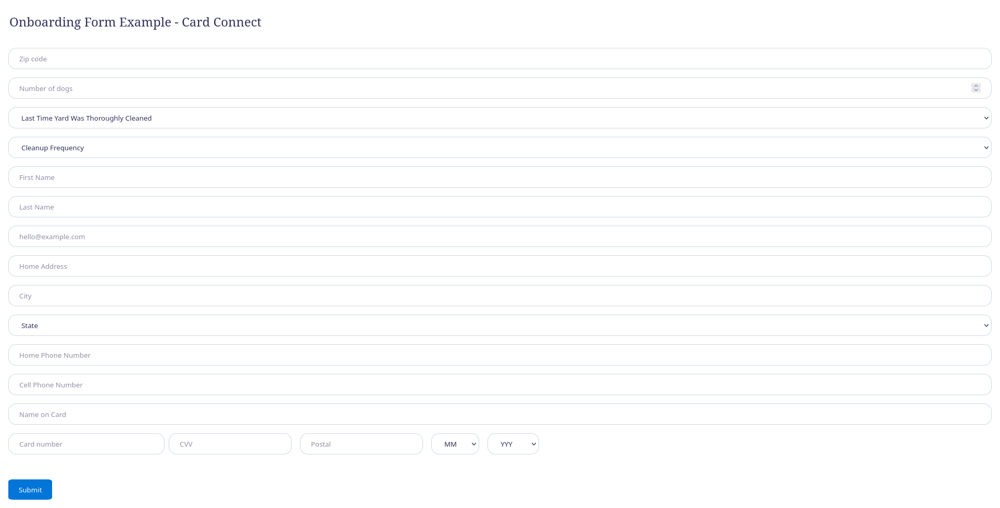
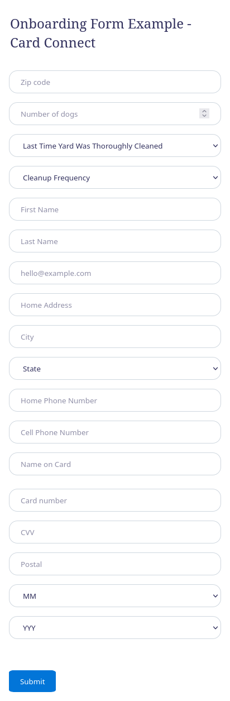

# Onboarding Form Example - Card Connect
**Table of content**
- [Onboarding Form Example - Card Connect](#onboarding-form-example---card-connect)
- [Running the demo](#running-the-demo)
- [Screenshots](#screenshots)

**Languages used for the example**
- HTML 
- JavaScript (Vanilla) 
- CSS 

This example containes a fully working demo of client onboarding process through **Sweep & Go Open API**.

Keep in mind that this demo contains only the required fields, there are more of them that you may want to use for your purpose, to see them all, please refer to https://openapi.sweepandgo.com/docs/#onboarding-new-clients-PUTapi-v1-residential-onboarding.

# Running the demo
Before you open the demo, you will need to add your **Sweep & Go Open API** key that you received from https://employee.sweepandgo.com/settings/open_api.

To do that, open `assets/js/script.js` and:
1. Replace the **YOUR-KEY** to the key you obtained from your Sweep & Go account on line **58** `'Authorization': 'Bearer YOUR-KEY'`.

# Screenshots

